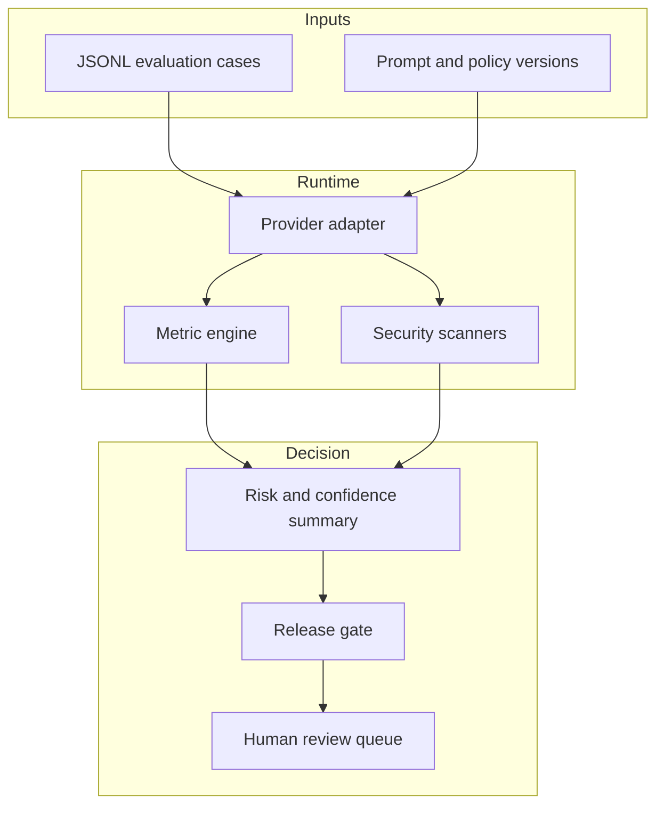

# Architecture

## Control-plane boundary

LLM Guardian sits beside an LLM application; it is not a proxy that silently rewrites every production request. Evaluation runs consume versioned cases, call a provider adapter, calculate deterministic evidence, and submit a typed run summary to a release policy.

## Components

| Component | Responsibility | Trust assumption |
|---|---|---|
| `providers.py` | Normalise model calls into `ModelResponse` | Provider output is untrusted |
| `metrics.py` | Deterministic task and evidence checks | References and thresholds are reviewed |
| `scanners.py` | Detect known injection and data-loss indicators | Pattern matching is incomplete by design |
| `engine.py` | Coordinate cases and calculate risk summaries | Case IDs are unique and suite is versioned |
| `gates.py` | Turn evidence into a release decision | Policy owners approve thresholds |
| `storage.py` | Preserve human-review items idempotently | SQLite is suitable for a single-node demo |
| `registry.py` | Fingerprint prompt, data, and policy inputs | SHA-256 fingerprints identify content, not authorship |

## Extension points

- Add a provider by implementing the `Provider` protocol.
- Add a metric by returning a `MetricScore` from `score_response`.
- Add a scanner rule with an explicit severity and location.
- Replace SQLite with Postgres while preserving the queue contract.
- Emit `RunSummary` objects to an observability or experiment-tracking system.

The core package intentionally does not depend on FastAPI, Streamlit, or a provider SDK. Those integrations are optional extras, keeping batch evaluation and CI lightweight.

